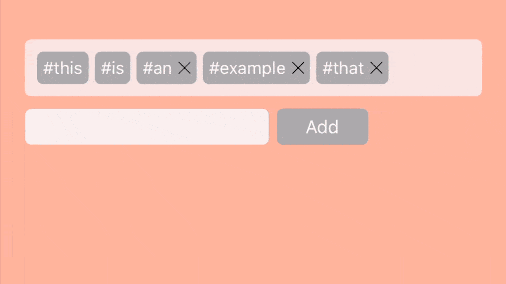

# Hashtags

[](https://travis-ci.org/scaraux/Hashtags)
[](https://cocoapods.org/pods/Hashtags)
[](https://cocoapods.org/pods/Hashtags)
[](https://cocoapods.org/pods/Hashtags)
[](https://cocoapods.org/pods/Hashtags)

<p align="center">
    
</p>


Hashtags is an iOS library for displaying, customizing and interacting with a list of #hashtags, written in Swift

## :star: Features
- Simplistic and easy to use
- Fully customizable
- Dynamic height


##  📲 Example

To run the example project, clone the repo, and run `pod install` from the Example directory first.

## 📋 Requirements

Hashtags requires iOS 9.0+

##  📦 Installation

Hashtags is available through [CocoaPods](https://cocoapods.org). To install
it, simply add the following line to your Podfile:

```ruby
pod 'Hashtags'
```

## 😏 Usage

### Basics

#### 1) Create a Hashtag

```swift
let tag = HashTag(word: "hashtag")
let tag = HashTag(word: "hashtag", withHashSymbol: false)
let tag = HashTag(word: "hashtag", withHashSymbol: true, isRemovable: true)
```

The boolean `isRemovable` defines if the hashtag can be removed from the list, by displaying a button next to it. The boolean `withHashSymbol` allows to automatically display a '#' symbol before the word.

***NOTE**: By default, the hashtag will display the hash symbol and won't be removable.*


####  2) Create the view

You can use the Hashtags view either directly from the code, or through your Interface Builder.

#####  With code:

```swift
var hashtags = HashtagView(frame: ...)

hashtags.backgroundColor = UIColor.lightGray
hashtags.tagBackgroundColor = UIColor.blue
hashtags.cornerRadius = 5.0
hashtags.tagCornerRadius = 5.0
hashtags.tagPadding = 5.0
hashtags.horizontalTagSpacing = 7.0
hashtags.verticalTagSpacing = 5.0

self.view.addSubview(hashtags)
```

#####  With Interface Builder:

Simply define a `UIView` and set its class to `HashtagsView`. You're all set.

<p align="left">
    
</p>

#### 3) Add hashtags to the view

```swift
let hashtag = ...
hashtagsView.addTag(tag: tag)
```

You can add one, or multiples hashtags at the time. Same if you want to remove them.

```swift
func addTag(tag: HashTag)
func addTags(tags: [HashTag])
func removeTag(tag: HashTag)
func removeTags()
```

### Dynamic height

You may want to expand the size of your `HashtagView` when the hashtags exceed the actual size of the view.

To do so, implement `HashtagsViewDelegate` :

```swift
UIViewController: HashtagsViewDelegate {

    func hashtagRemoved(hashtag: HashTag) {
        // Your code here
    }
    func viewShouldResizeTo(size: CGSize) {
        // Your code here
    }
}
```

#### Example:

One simple way to expand the height of your `HashtagsView`  when needed is to set a height constraint on it (from the code or interface builder). Then you can modify the `constant` property of the constraint when the view needs to be expanded. Add an animation and you got it !

<p align="left">
    
</p>

```swift
UIViewController: HashtagsViewDelegate {
    func viewShouldResizeTo(size: CGSize) {
        guard let constraint = self.heightConstraint else {
            return
        }
        constraint.constant = size.height
        UIView.animate(withDuration: 0.4) {
            self.view.layoutIfNeeded()
        }
    }
}
```

***NOTE:** If you are using interface builder, you might want to link your height constraint to your parent view with an `@IBOutlet`. Check our example project for more details.*


##  🎨 Customization

### Appearance

You can change style attributes of the view and the design of the hashtags themselves.

##### Padding inside the whole view:

- `containerPaddingLeft`

- `containerPaddingRight`

- `containerPaddingTop`

- `containerPaddingBottom`

##### Padding inside each hashtag:

 - `tagPaddingLeft`

 - `tagPaddingRight`

 - `tagPaddingTop`

 - `tagPaddingBottom`

##### Spacing between hashtags:

 - `horizontalTagSpacing`

 - `verticalTagSpacing`

##### Hashtags appearance:

 - `tagCornerRadius`

 - `tagBackgroundColor`

 - `tagTextColor`

 - `removeButtonSize`

 - `removeButtonSpacing`

If you decided to define the view from Interface Builder, you have access to those values too.

<p align="left">
    
</p>

## 👱 Author

Oscar Gotting ([@Scaraux](https://twitter.com/scaraux))

## :heart_eyes: Credits

[AlignedCollectionViewFlowLayout](https://github.com/mischa-hildebrand/AlignedCollectionViewFlowLayout) by [Mischa Hildebrand](https://github.com/mischa-hildebrand)
## 🚔 License

Hashtags is available under the MIT license. See the LICENSE file for more info.
